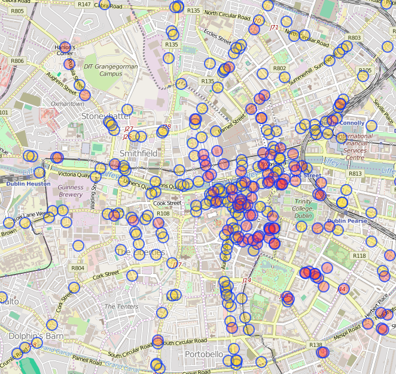
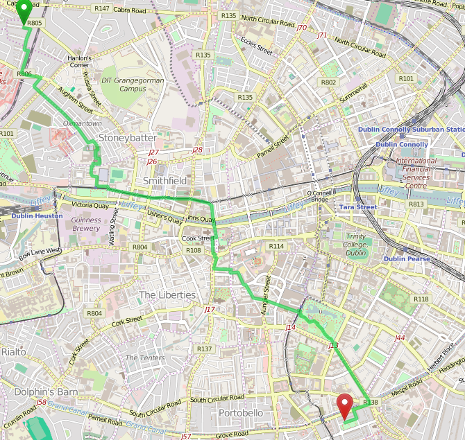
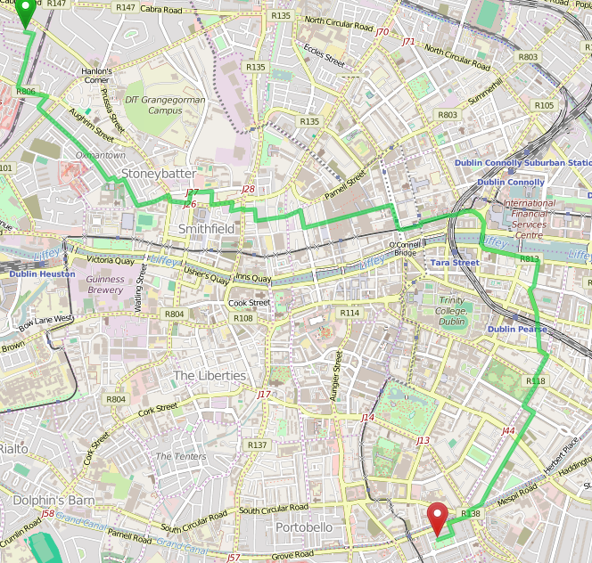

# Path through Dublin without a pub

This is a simplistic implementation of the idea found [here](http://www.kindle-maps.com/blog/how-to-walk-across-dublin-without-passing-a-pub-full-publess-route-here.html)
to see if it is possible to avoid pubs when walking through Dublin (or any other town).

# Installation

 * git clone https://github.com/karussell/pub-route-dublin
 * get the area of your choice, i.e. download a PBF e.g. for [Dublin](http://download.bbbike.org/osm/bbbike/Dublin/)
 * update the export.geojson if not Dublin
 * `mvn clean install assembly:single`
 * `java -jar target/pub-route-dublin-1.0-SNAPSHOT-jar-with-dependencies.jar osmreader.osm=your.pbf config=config.properties`

# Pub Data

# Original Route is 5.8km

# Avoiding Route is 7.3km

# License

Apache License 2.0